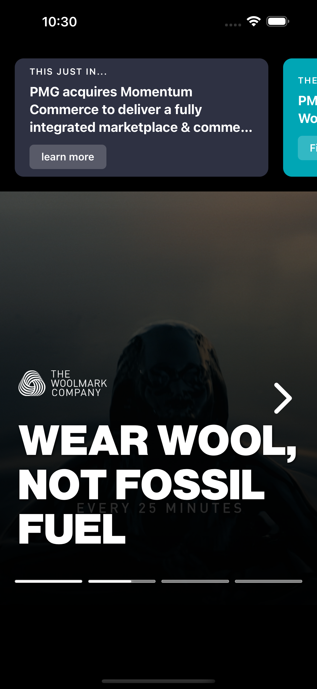
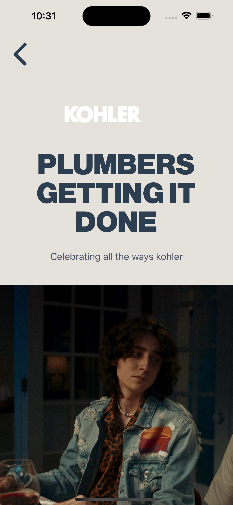

# PMG Sancrisoft App

A React Native mobile application built with Expo, featuring dynamic content from Contentful CMS including announcements carousel and hero slider.

## 🚀 Features

- **Announcements Carousel**: Horizontal scrolling cards displaying announcements with custom backgrounds and CTAs
- **Hero Slider**: Full-screen story-style slider with video/image backgrounds and interactive navigation
- **Dynamic Content**: Content managed through Contentful CMS
- **Modern Navigation**: Stack-based navigation with React Navigation
- **Type-Safe**: Built with TypeScript for enhanced developer experience

## 📸 Screenshots

<div align="center">

### Home Screen with Hero Slider



*Hero slider showcasing different campaigns with video/image backgrounds and progress indicators*

### Product Detail Screen


*Detailed product view with brand logo, title, subtitle, media section, and capabilities*

</div>

**Features Shown:**
- ✅ Announcements carousel at the top with "THIS JUST IN..." section
- ✅ Full-screen hero slider with brand campaigns
- ✅ Progress bars indicating slider position
- ✅ Product detail screen with dynamic content from Contentful
- ✅ Responsive design with custom typography (Nimbus Sans)
- ✅ Video playback support in hero sections

## 📋 Prerequisites

Before you begin, ensure you have the following installed:

- **Node.js** (v18 or higher)
- **npm** or **yarn**
- **Expo CLI**: `npm install -g expo-cli`
- **iOS Simulator** (Mac only) or **Android Studio** for testing

## 🛠️ Installation

1. **Clone the repository**
   ```bash
   git clone <repository-url>
   cd pmg-sancrisoft-app
   ```

2. **Install dependencies**
   ```bash
   npm install
   ```

3. **Configure Environment Variables**
   
   Create a `.env` file in the project root:
   ```bash
   touch .env
   ```

4. **Add your Contentful tokens to `.env`**
   ```env
   ANNOUNCEMENTS_TOKEN=
   HERO_SLIDER_TOKEN=
   ```
   
   **Important:** You must create the `.env` file with valid tokens for the app to work.

5. **Start the development server**
   ```bash
   npm start
   # or
   npx expo start
   ```

6. **Run on a device/simulator**
   - Press `i` for iOS simulator
   - Press `a` for Android emulator
   - Scan QR code with Expo Go app on your physical device

## 📁 Project Structure

```
pmg-sancrisoft-app/
├── src/
│   ├── components/          # Reusable UI components
│   │   ├── HorizontalCarousel.tsx
│   │   └── StoriesSlider.tsx
│   ├── navigation/          # Navigation configuration
│   │   ├── index.tsx        # Stack navigator setup
│   │   └── screens/         # Screen components
│   │       ├── HomeScreen.tsx
│   │       └── ProductScreen.tsx
│   ├── services/            # API & Apollo Client setup
│   │   ├── apollo.ts        # GraphQL client configuration
│   │   └── queries.ts       # GraphQL queries & types
│   └── types/               # TypeScript type definitions
│       └── navigation.ts
├── assets/                  # Images, fonts, and static files
│   ├── fonts/              # Custom fonts (create this folder)
│   └── *.png               # App icons
├── app.config.js           # Expo configuration (dynamic)
├── App.tsx                 # Root component
├── index.ts                # Entry point
├── tsconfig.json           # TypeScript configuration
├── package.json            # Dependencies and scripts
└── README.md              # This file
```

## 🎨 Custom Fonts

**✅ Nimbus Sans is configured and loaded!**

The app includes the following Nimbus Sans font families:
- `Nimbus-Sans` (Regular)
- `Nimbus-Sans-Bold` (Bold)
- `Nimbus-Sans-Black` (Heavy/Black weight - used in hero titles)
- `Nimbus-Sans-Italic`
- `Nimbus-Sans-Bold-Italic`
- `Nimbus-Sans-UltraLight`

**Usage example:**
```typescript
<Text style={{ fontFamily: 'Nimbus-Sans-Black', fontSize: 48 }}>
  Bold Headline
</Text>
```

See `FONTS.md` for complete font documentation and usage guide.

## 🔧 Configuration

### Contentful API Endpoints

The app connects to two Contentful spaces:

1. **Announcements API**
   - Endpoint: `https://graphql.contentful.com/content/v1/spaces/951t4k2za2uf/environments/master`
   - Used for: Announcement carousel items

2. **Hero Slider API**
   - Endpoint: `https://graphql.contentful.com/content/v1/spaces/tyqyfq36jzv2/environments/master`
   - Used for: Hero slider content

### Environment Variables

Tokens are managed through `app.config.js` and can be set via:

1. **`.env` file** (recommended for development)
2. **Fallback defaults** in `app.config.js` (for quick testing)
3. **CI/CD environment variables** (for production builds)

Access tokens in code via:
```typescript
import Constants from 'expo-constants';
const token = Constants.expoConfig?.extra?.announcementsToken;
```

## 📱 Available Scripts

- `npm start` - Start the Expo development server
- `npm run android` - Run on Android emulator
- `npm run ios` - Run on iOS simulator
- `npm run web` - Run in web browser

## 🏗️ Technologies Used

- **React Native** (0.81.4) - Mobile framework
- **Expo** (SDK 54) - Development tooling
- **TypeScript** - Type safety
- **React Navigation** - Navigation library
- **Apollo Client** (v4) - GraphQL client
- **Contentful** - Headless CMS
- **Expo Video** - Video playback
- **Expo Linear Gradient** - Gradient components

## 🎨 Key Components

### HorizontalCarousel
Displays announcements in a horizontal scrolling carousel with:
- Custom background colors
- Intro text, message, and CTA buttons
- Deep linking support to PMG website
- Text truncation for longer messages

### StoriesSlider
Instagram-style full-screen slider featuring:
- Video/image backgrounds
- Progress indicators
- Dark backdrop overlay option
- Auto-advance timer
- Navigation controls

## 🔐 Security Notes

- Never commit `.env` files to version control
- The `.env` file is already added to `.gitignore`
- Rotate API tokens regularly
- Use different tokens for development and production

## 🐛 Troubleshooting

### Module resolution errors
```bash
# Clear cache and reinstall
rm -rf node_modules
npm install
npx expo start --clear
```

### TypeScript errors
```bash
# Ensure tsconfig.json has jsx enabled
# Should include: "jsx": "react-native"
```

### Apollo Client hook errors
```bash
# Reinstall Apollo Client
npm uninstall @apollo/client
npm install @apollo/client graphql
```

## 📝 License

Copyright 2025 PMG. All rights reserved.

## 🤝 Contributing

1. Create a feature branch
2. Make your changes
3. Test thoroughly
4. Submit a pull request

## 📞 Support

For questions or issues, please contact the development team.

---

Built with ❤️ by the PMG team

